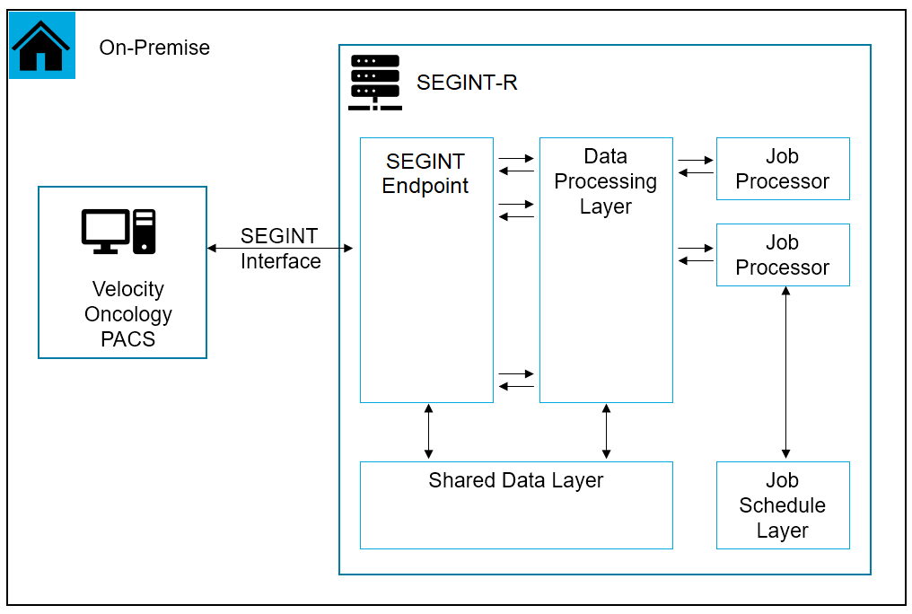
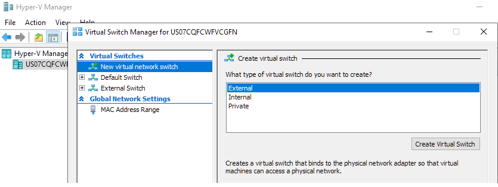
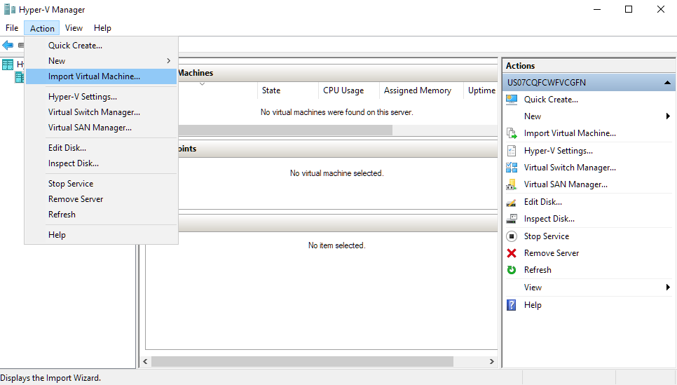
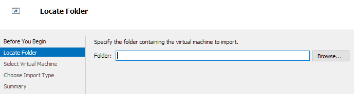
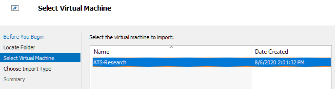
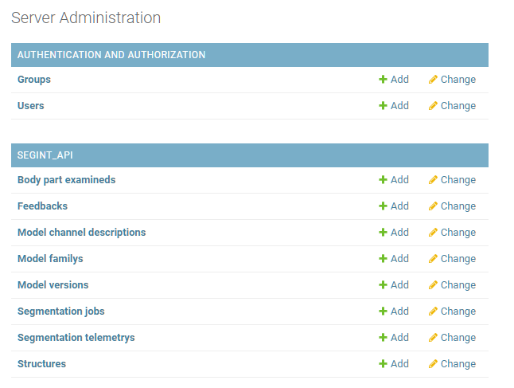
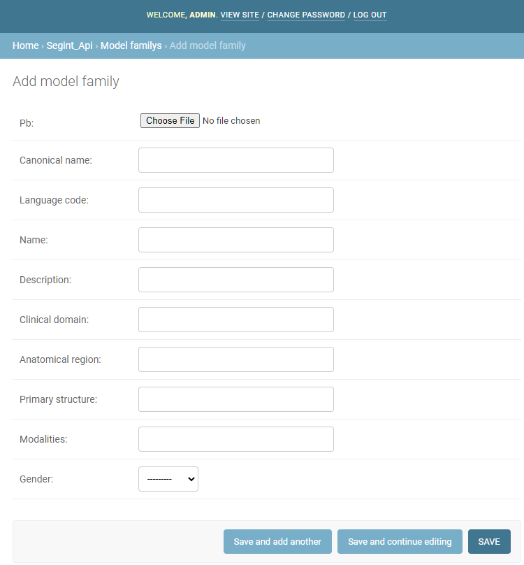
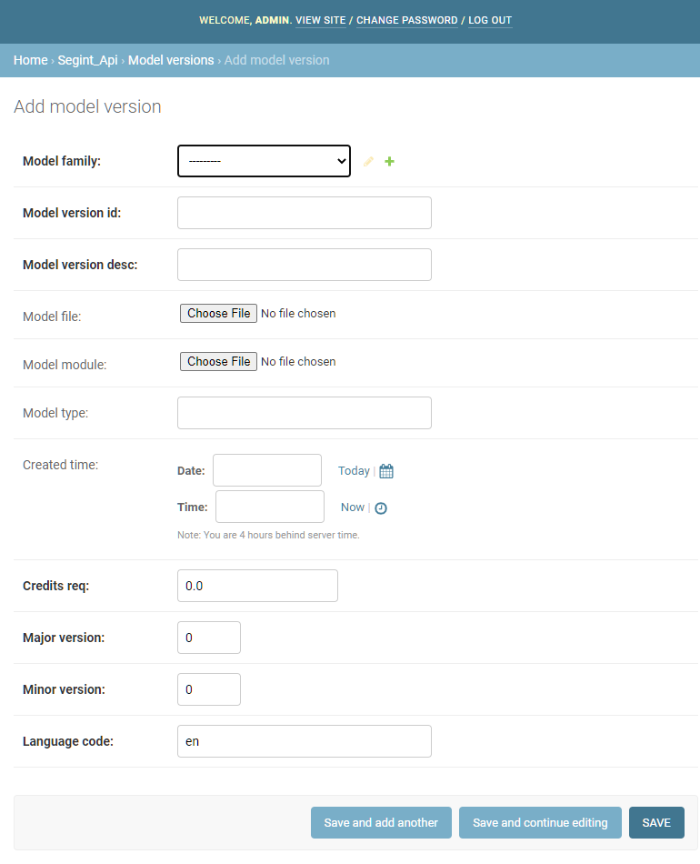
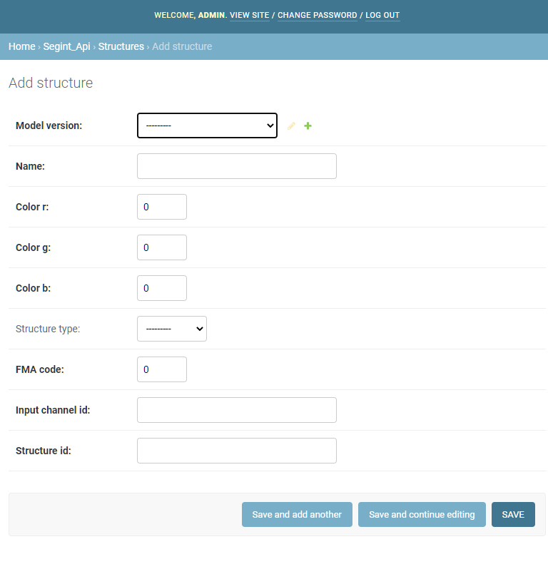
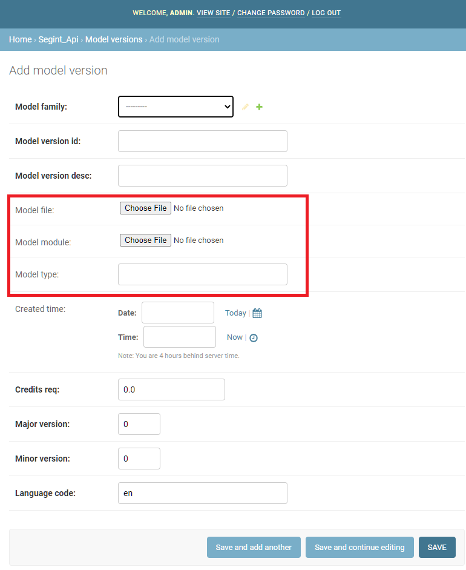

# Remote Segmentation Interface (SegInt) Server

## Table of Contents

1. [**Introduction**](#introduction)
    * [*Design*](#design) 
2. [**Getting Started**](#getting-started)
    * [*Requirements*](#requirements)
    * [*Manual Installation*](#manual-installation)
    * [*Hyper-V Installation*](#hyper-v-installation)
3. [**Server Operations**](#server-operations)
    * [*Server Administration*](#server-administration)
    * [*Server Runtime*](#server-runtime)
    * [*Model Upload*](#model-upload)
4. [**For Developers**](#for-developers)
    * [*Directory Structure*](#directory-structure) 
    * [*Testing*](#testing)
    * [*Model Specifications*](#model-specifications)
    * [*Machine Learning Library Extensions*](#machine-learning-library-extensions)
4. [**Appendix**](#appendix)
    *  [*Roadmap of Planned Features*](#roadmap-of-planned-features) 
    *  [*Built With*](#built-with)
    *  [*Contributing Authors*](#contributing-authors)


## Introduction

**Remote Segmentation Interface (SegInt) Server** (SegInt-R) is an on-premise auto-segmentation transaction server for research institutions with machine learning models.  SegInt-R is designed to work in conjunction with [Velocity](https://www.varian.com/products/interventional-solutions/velocity), a universal bioinformatics solution that consolidates imaging information from virtually any imaging source.  The server is operated locally in order for research teams to design and test their own machine learning models.

Back to [**Table of Contents**](#table-of-contents).  

### Design

A brief overview of the server architecture: 



SegInt-R and Velocity communicate via endpoints specified in the [Microsoft Radiomics Segmentation API](https://app.swaggerhub.com/apis/mliang1987/SegIntAPI/1.0.0) as part of [Project InnerEye](https://www.microsoft.com/en-us/research/project/medical-image-analysis/).  Messages are serialized using Google's [protocol buffers](https://developers.google.com/protocol-buffers).

Endpoints and associated data-processing are implemented in [Django](https://www.djangoproject.com/), using the default [SQLite](https://www.sqlite.org/index.html) as a shared data layer.  Once jobs are received, asynchronous segmentation jobs are scheduled using [Celery](https://docs.celeryproject.org/en/stable/), a real-time task scheduler. In this implementation, Celery workers are supported with a [Redis](https://redis.io/) backend as a message broker.

Back to [**Table of Contents**](#table-of-contents).  

## Getting Started

SegInt-R works natively on Linux and was developed on Ubuntu 18.04 LTS.  It can be installed directly after cloning from the repository or through the provided VMDK.  This allows the user to build natively or run the service through virtualization, either on type-1 hypervisors such as Windows Hyper-V or type-2 hypervisors such as Virtualbox.

### Requirements

1. Network - The server must be able to access the local network, and so must operate with a Bridged Adapter if virtualized.
2. Disk Space - The server requires at least 15GB of disk space, not including models and jobs that must be stored locally.
3. Memory - The server requires at least 2GB of memory to operate.

Back to [**Table of Contents**](#table-of-contents).  

### Manual Installation

The following are directions for installation within one's own Linux environment.  Note: This section is written to be as beginner-friendly as possible.

First, ensure that Git is installed locally:

    $ sudo apt update
    $ sudo apt install git

You can confirm that Git has been installed correctly by running this command and receiving similar output:

    $ git --version

    git version 2.17.1

Once Git has been installed, clone the repository into the desired directory:

    git clone <PATH TO REPOSITORY>

Navigate to the repository directory.  Run the install script `install.sh`:

    bash install.sh

The install script will install the necessary python packages for the server within a virtual environment `segint_venv`, as well as Redis.  Required packages for the server are described in [`requirements.txt`](requirements.txt), and packages for the segmentation layer are described in [`requirements_ml.txt`](requirements_ml.txt).  The install script will also add aliases to your `.bashrc` corresponding to `run` and `kill` scripts, respectively.

Back to [**Table of Contents**](#table-of-contents).  

### Hyper-V Installation

For Windows users, SegInt-R is provided as an exported VM for usage in conjunction with [Hyper-V](https://docs.microsoft.com/en-us/virtualization/hyper-v-on-windows/about/), a native hypervisor in Windows.  Once extracted from the archive, the VM can be easily installed using Windows' Hyper-V Manager application.  Note: Hyper-V is a level 1 hypervisor, and thus is not recommended that other level 2 hypervisors (e.g. VirtualBox) are operating simultaneously. 

Prior to importing the VM, it is necessary to create an external virtual switch.  For this server, the switch can be simply named: "External Switch".



Once the switch has been created, import a virtual machine through the `Action` dropdown context menu.  



Locate the folder extracted from the VM archive.



Select the virtual machine `ATS-Research`.  You will need to decide if this VM will point to this extracted archive directory, or will create a new copy in a specified Hyper-V folder.



Once imported, running the server will require generic credentials:

    username: atsr
    password: atsr

It is highly recommended that the password is changed upon installation.

Back to [**Table of Contents**](#table-of-contents).  

## Server Operations

### Server Administration

#### Activating the Virtual Environment

While the virtual environment is automatically loaded upon server startup, sometimes it may be necessary to activate it manually in order to manage the server.  In order to activate the virtual environment, navigate to main repository directory, and use the following command:

    $ source segint_venv/bin/activate

To deactivate this virtual environment, use the following command anywhere:

    $ deactivate

Back to [**Table of Contents**](#table-of-contents).  

#### Create Admin Superuser

Generally, an `admin` superuser is included in the installation, with the following default credentials:

    username: admin
    password: segint00

If this is not the case, before server startup, it is highly recommended to create an administrative superuser.  To do so, first navigate to the `segint_research_django` sub-directory within the repository directory.  Once there, create a superuser:

    $ python3 manage.py createsuperuser

Or, if your virtual environment is active:

    $ python manage.py createsuperuser

Enter your desired username and press enter.

    Username: admin

You will then be prompted for your desired email address.  You may leave this blank.

    Email address: admin@example.com

The final step is to enter a password.  You will be asked for the password twice as confirmation.

    Password: *********
    Password (again): *********
    Superuser created successfully.

Back to [**Table of Contents**](#table-of-contents).  

#### Determining Server IP Address

Prior to operation, it is necessary to determine the IPv4 address of the machine.  This can be found with:

    $ ip addr

You will be looking for full IPv4 address.  You will not be using the localhost address.

Your Velocity installation will need to point towards this IP address in order to operate in conjunction.

Back to [**Table of Contents**](#table-of-contents).  

#### Accessing the Admin Console

Once the server is up-and-running (See [Server Startup](#server-startup)), you may access the admin console via web browser from any computer on the local network.  Use the credentials for the superuser (See [Create Admin Superuser](#create-admin-superuser)).

You will also need to know the IPv4 address of the server (See [Determining Server IP Address](#determining-server-ip-address)).  Access the console from a web browser at the following address:

    http://<Server IPv4 Address>:8000/admin/

You should see the admin's login screen:


Once logged in, you will be able to access the admin panel, from where you may modify database entries:



Back to [**Table of Contents**](#table-of-contents).  

### Server Runtime

#### Server Startup

To run the server, navigate to repository directory, and input the following command.

    $ segint_run

This will start the Django server, the Celery worker, and the Celery task scheduler.

Back to [**Table of Contents**](#table-of-contents).  

#### Server Shutdown

To stop all services related to SegInt-R, including the Django server and all associated Celery threads, input the following command in any console:

    $ segint_kill

Note: This will kill all Django processes and all Celery processes on the machine!

Back to [**Table of Contents**](#table-of-contents).  

### Model Upload

All trained machine learning models must be defined as part of a model family. For now, model family creation requires either:

1. Manual upload within the database through the admin console
2. Upload of fully-defined Protobuf ModelFamily message

See the [roadmap](#roadmap-of-planned-features) for future plans regarding model creation and upload.

Back to [**Table of Contents**](#table-of-contents).  

#### Manual Model Upload

If manually creating a model family and/or accompanying models and structures, access the Django admin console.  Creating a new Model Family will display the following necessary fields:



Note here that the protobuf file field is optional.  In fact, upon model family acquisition by Velocity, a protobuf message will be automatically generated and stored in the directory.

Once the model family has been specified and saved, go back to the admin console and create a new model version:



Ensure that the `Model family` field points directly to the newly created (or existing) model family in the database.

The `Model file` field designates a machine learning model file within the `media/models/` directory.  For instance, a Pytorch model file would be `model.pt`, and would contain the weights, biases, etc. of the model.  Uploading such a file will automatically make a copy within the correct subdirectory.

In addition, for libraries that require a separate class definition of the neural network architecture, the `Model module` field should point to that `.py` file.  Again, this upload will automatically be placed within the `media/models/` directory.

`Model type` should descripted what type of library was used to trained the model, e.g. Tensorflow, Pytorch, etc.  This will be enumerated in the future.

Lastly, once the model version has been saved, structures will need to be defined that correspond to what will be segmented by the model.  Go back to the admin console again and create a new structure:



Similarly to the model version object, the structure here will have a `Model version` field that needs to point to the newly created (or existing) model version database object.

Back to [**Table of Contents**](#table-of-contents).  

#### Protobuf Upload

If uploading a fully-defined Protobuf model family definition, in the Django admin console, create a new model family.  Instead of populating the fields, upload a serialized and saved Protobuf message, and save the model family database object.

When Velocity first acquires all model families from the server, the fields will auto-populate.  However, one set of fields will not populate, as they are not contained with the Protobuf specification.  After field auto-population, an admin will need to go to the Django console and manually point the model fields towards the correct files.  This can be found in the model version for the newly updated family:



The `Model file` field designates a machine learning model file within the `media/models/` directory.  For instance, a Pytorch model file would be `model.pt`, and would contain the weights, biases, etc. of the model.  Uploading such a file will automatically make a copy within the correct subdirectory.

In addition, for libraries that require a separate class definition of the neural network architecture, the `Model module` field should point to that `.py` file.  Again, this upload will automatically be placed within the `media/models/` directory.

`Model type` should descripted what type of library was used to trained the model, e.g. Tensorflow, Pytorch, etc.  This will be enumerated in the future.

Save the Model Version when done.

Back to [**Table of Contents**](#table-of-contents).  

## For Developers

This section will detail the architecture of the server platform for future extensibility.

### Directory Structure

The Django server application can be found within the directory `segint_research_django`.  The overall directory structure is listed below:

    - segint_research_django
        - media
        - protobuf
        - segint_api
        - segint_research_django

#### Media Subdirectory

The `media` sub-directory contains on-disk storage for any database elements:

    - segint_research_django
        - media
            - modelfamily
            - models
            - results
            - segmentation

Briefly, the sub-directories within `media` functions as on-disk storage for:

1. `modelfamily` - Serialized Protobuf messages containing all information regarding a ModelFamily.
2. `models` - Any saved ML model files and associated class definitions.
3. `results` - Serialized Protobuf messages containing segmentation results.
4. `segmentation` - Serialized Protobuf messages containing a segmentation job posted by Velocity.

Back to [**Table of Contents**](#table-of-contents).  

#### Protobuf Subdirectory

The `protobuf` app folder contains all Protobuf definitions for communication between Velocity and the server, as well as compiled Python definitions.  Of particular note are:

1. [`Model.proto`](segint_research_django/protobuf/Model.proto) - Definitions for SEGINT API
2. [`Primitives3D.proto`](segint_research_django/protobuf/Primitives3D.proto) - Primitives that support Model.proto

For more information regarding Protobuf and Python, see the [tutorial](https://developers.google.com/protocol-buffers/docs/pythontutorial).

Back to [**Table of Contents**](#table-of-contents).  

#### SEGINT_API Subdirectory

This Django application contains the bulk of the server code.  The sub-directories within `segint_api` is listed:

    - segint_research_django
        - segint_api
            - admin.py
            - apps.py
            - models.py
            - tasks.py
            - tests.py
            - urls.py
            - views.py

This application follows a traditional Django application structure, with endpoint URLS defined in [`urls.py`](segint_research_django/segint_api/urls.py), GET and POST tasks defined in [`views.py`](segint_research_django/segint_api/views.py), and SQL database models defined in [`models.py`](segint_research_django/segint_api/models.py).

Of particular note is that [`tasks.py`](segint_research_django/segint_api/tasks.py) contains the asynchronous Celery segmentation code.  In order to extend segmentation functionality to additional machine learning libraries, new segmentation functions will need to be defined there.  (See [Machine Learning Library Extensions](#machine-learning-library-extensions) below).

Back to [**Table of Contents**](#table-of-contents).  

#### SEGINT_Research_Django Subdirectory

This is the main Django server directory, and contains the following:

    - segint_research_django
        - segint_research_django
            - asgi.py
            - celery.py
            - settings.py
            - urls.py
            - views.py
            - wsgi.py

Of particular noteworthiness is [`celery.py`](segint_research_django/segint_research_django/celery.py), which contains the celery program specification.

Back to [**Table of Contents**](#table-of-contents).  

### Testing

A Django test suite is provided for testing of the server.  Django's tests use the Python standard library module `unittest`.  All provided testcases classes subclass from `django.test.TestCase`, which is itself a subclass of `unittest.TestCase`.

Currently, integration tests are provided in [`segint_research_django/tests.py`](segint_research_django/segint_research_django/tests.py).  Unit tests may be written separately in any other Django application as `tests.py`.  The TestRunner will run any such file upon testing.

To run the tests, ensure that the virtual enviroment is activated (See [Activating the Virtual Environment](#activating-the-virtual-environment)).  In addition, the `celery beat` scheduler won't be able to point to the temporary testing database, so asynchronous tasks will need to be run synchronously. To make this temporary change, you will need to change the `CELERY_ALWAYS_EAGER` flag to `True` in [`settings.py`](segint_research_django/segint_research_django/settings.py).  Ensure that you change this back after testing.

Then, within the main project directory, use the following command:

    $ python manage.py test

If you wish to measure code coverage, first ensure that [`coverage.py`](https://coverage.readthedocs.io/en/coverage-5.2.1/) is installed in the virtual environment.  Note: coverage isn't provided as part of the requirements for the server.

    $ pip install coverage

Then, in the main project directory, you may run the tests:

    $ coverage run --source='.' manage.py test

This runs your tests and collects coverage data of the executed files.  You may see a report of the coverage data by using the following command:

    $ coverage report -m

Back to [**Table of Contents**](#table-of-contents).

### Model Specifications

SegInt-R receives scan data from Velocity in the form of a Protobuf message containing a list of input channels (See ModelInputChannel in [`Model.proto`](segint_research_django/protobuf/Model.proto)).  Each channel contains a calibrated three-dimensional volume Protobuf message (See CalibratedVolume3D in [`Primitives3D.proto`](segint_research_django/protobuf/Primitives3D.proto)).  Within the data processing layer, the volume message is recasted as a three-dimensional `numpy.ndarray` of 32-bit signed integers.  

    channel_data - ndarray of shape (depth, height, width)

The values of the ndarray represent calibrated values (e.g. Hounsfield units).  Generally speaking, `depth` corresponds to axial length, while `height` and `width` are standardized at 512 voxel-units.

Segmentation models should be trained under these assumptions for input.  Output should correspond to a similarly-shaped array of boolean value type where `0` represents *background* and `1` represents *foreground*.

Back to [**Table of Contents**](#table-of-contents).  


### Machine Learning Library Extensions

As of the current version, PyTorch is supported.  In order to extend functionality to other machine learning libraries, the following files will need to be modified:

    - segint_research_django
        - segint_api
            - models.py
            - tasks.py
            - views.py

[`tasks.py`](segint_research_django/segint_api/tasks.py) contains asynchronous Celery tasks for segmentation jobs.  Below is a prototypical segmentation task:

```
@task(name="start_pytorch_segmentation_single_structure")
def start_pytorch_segmentation_single_structure(model_id, job_id):
    '''
    Single structure pytorch segmentation.

    Parameters:
        model_id - str - Model ID to use for segmentation job
        job_id - str - Segmentation job ID
    Returns: None
    '''
    
    logger.info("\nStarting Pytorch with job_id {} and model_id {}".format(job_id, model_id))

    # Find the job
    try:
        seg_job = SegmentationJob.objects.get(model_id=model_id, segmentation_id=job_id)
        m_v = ModelVersion.objects.filter(model_version_id=model_id)[0]
        structure = Structure.objects.filter(model_version=m_v)[0]
    except:
        logger.info("\nCan't find job!")
        return
        
    # Segmentation schema. 
    model_in = acquire_model_input(seg_job)
    channels_data = parse_model_in(model_in)
    segment_result = volumetric_pytorch_segment(m_v, channels_data)
    model_out = construct_model_out(m_v, structure, segment_result)
    save_to_disk(seg_job, model_out)
```

Let's go over the anatomy of such a function.

1. The decorator `@task(name="start_pytorch_segmentation_single_structure")` marks this function as a Celery asynchronous task.  The decorator name should match the function name.  This will be called in your [`views.py`](segint_research_django/segint_api/views.py) to start an asynchronous task.
2. Find the database objects that are needed for the segmentation job.
3. Segment according to a specific schema.  Helper functions are provided in [`tasks.py`](segint_research_django/segint_api/tasks.py).  All extensible segmentation tasks should follow this schema:
    1. Acquire job model input
    2. Parse job model_input as channel data
    3. **Model evaluation/segmentation upon channel data**
    4. Construct model output using segmentation results
    5. Save to disk.

Of particular note is the "Model evaluation/segmentation" step.  This will require custom code that evaluates the model input numpy array with the specific model.  Note that this is different for each ML library.

Once the asynchronous segmentation task has been defined, [`views.py`](segint_research_django/segint_api/views.py) will also require modification.  Within the `post_segmentation()` function, a state machine is defined for every possible model type.  A new state will need to be added to the machine to call the new asynchronous function.  To do so, invoke `delay()`.  An example using the above task is shown below.

    start_pytorch_segmentation_single_structure.delay(model_id, seg_job.segmentation_id)

Lastly, in order to add your new ML library segmentation as an option within database, you will need to modify the ModelType enumeration within the `ModelVersion` class in [`models.py`](segint_research_django/segint_api/models.py).

Back to [**Table of Contents**](#table-of-contents).  

## Appendix

### Roadmap of Planned Features

1. Model Creation and Upload Form
2. Scikit-Learn extension
3. Caffe2 extension
4. XGBoost extension
5. Multi-structure Segmentation
6. Auth Tokens

Back to [**Table of Contents**](#table-of-contents).  

### Built With

**Python**


**Django**


**Celery**


**Redis**


**SQLite**


Back to [**Table of Contents**](#table-of-contents).  


### Contributing Authors

**Michael Liang**  
<a href="mailto:michael.liang@varian.com">michael.liang@varian.com</a>  
Software Engineer II

Back to [**Table of Contents**](#table-of-contents).  
